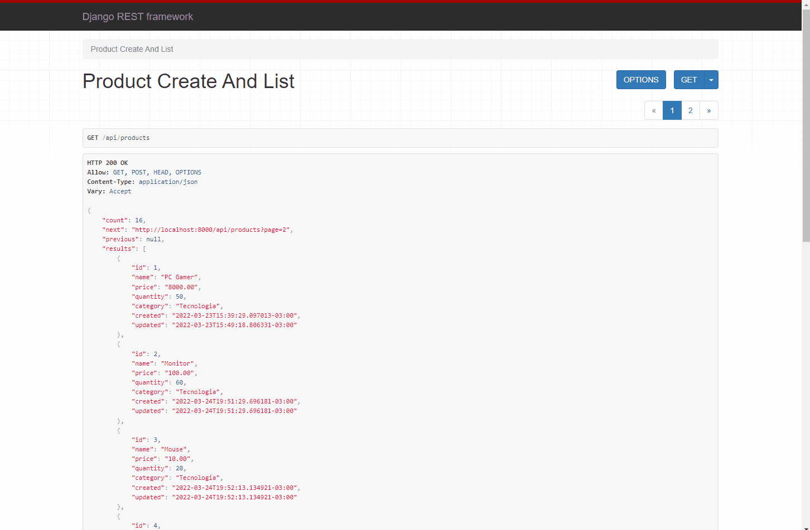
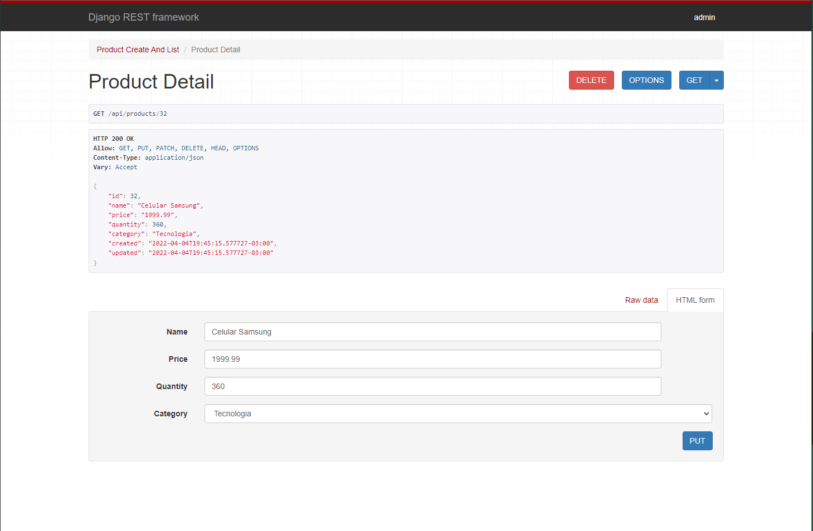
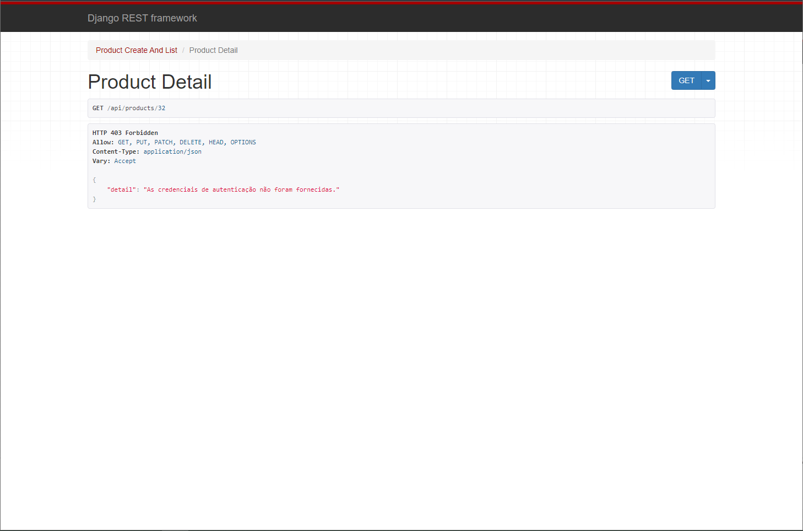
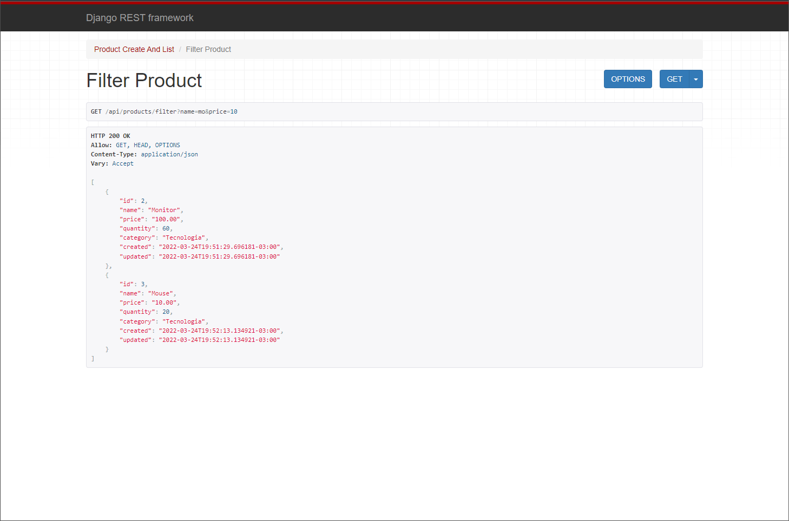
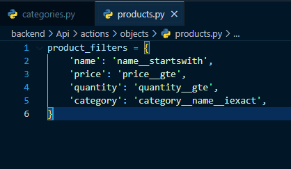
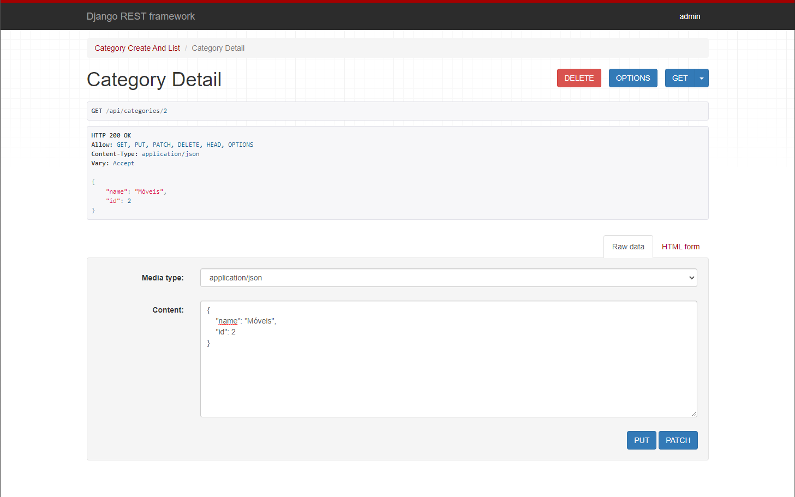
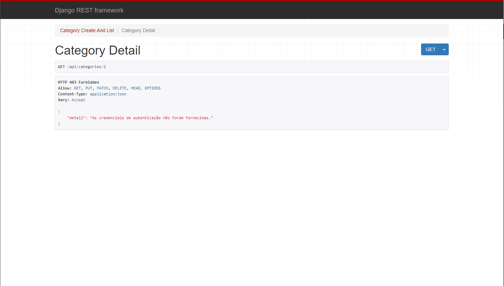
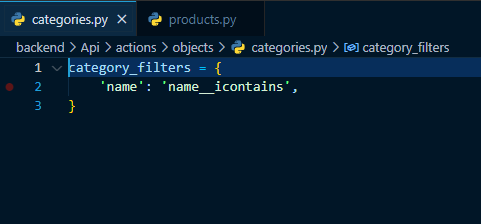

<h1>Projeto com Django Rest Framework</h1>

Projeto para gerenciar estoque de produtos de uma empresa

<h2 style="margin-top: 30px;">🚀 Features</h2>

<li>Paginação</li>
<li>Autenticação</li>
<li>Cache</li>

<h2 style="margin-top: 30px;">🏷️ Modelagem do banco de dados</h2>

<h3>Produtos</h3>
<ul>
<li>ID</li>
<li>Nome</li>
<li>Preço</li>
<li>Quantidade</li>
<li>Categoria</li>
<li>Data de criação</li>
<li>Data de última modificação</li>
</ul>

<h3>Categoria</h3>
<ul>
<li>ID</li>
<li>Nome</li>
</ul>

<h2 style="margin-top: 30px;">🔗 APIs</h2>

<ul>

<li>
    <h3>/api/products</h3>
    
Lista de produtos com paginação

    
    
Se usuário estiver autenticado ele poderá criar produtos com método POST

    
     
</li>

<li>
    <h3>/api/products/[product-id]</h3>
    
Página para editar dados ou excluir um produto, no exemplo o ID do produto é 32

    
    
Para acessar esta página, o usuário deve estar autenticado, caso não esteja a requisição recebe um status code de 403 e a tela abaixo

    
     
</li>

<li>
    <h3>/api/products/filter</h3>
    
Lista todos os produtos apartir dos filtros indicados na url, neste caso é nome=mo e preço=10

    
    
As KEYS indicam o nome do parâmetro que deve ser indicado na url, os VALUES indicam o tipo de filtro

    
     
</li>

<li>
    <h3>/api/categories</h3>
    
Lista de categorias com paginação

    
    
Se usuário estiver autenticado ele poderá criar categorias com método POST, usando form html ou um JSON

    
     
</li>
    
<li>
    <h3>/api/products/[category-id]</h3>
    
Página para editar dados ou excluir um categoria, no exemplo o ID do produto é 2

    
    
Para acessar esta página, o usuário deve estar autenticado, caso não esteja a requisição recebe um status code de 403 e a tela abaixo

    
     
</li>

<li>
    <h3>/api/categories/filter</h3>
    
Lista todas as categorias apartir dos filtros indicados na url, neste caso é nome=i

    
    
Filtros

    
     
</li>
    
</ul>
